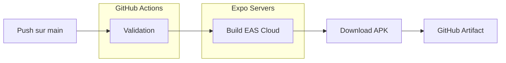

# PipCam - Détection automatique des pips de dominos

Application React Native (Expo) pour détecter automatiquement les pips sur les dominos et calculer les scores de manière automatique.

## 🎯 Fonctionnalités

- 📸 **Scan de dominos** : Capture d'image avec la caméra native
- 🔍 **Détection automatique** : Utilisation d'OpenCV.js pour détecter les pips
- 👥 **Multi-joueurs** : Support pour 3 joueurs (A, B, C)
- 📊 **Gestion de scores** : Calcul automatique et suivi des scores
- 📜 **Historique** : Sauvegarde des parties terminées
- 💾 **Persistance** : Sauvegarde automatique des données locales

## 🚀 Démarrage du projet

### Prérequis

- **Node.js** (version 18 ou supérieure)
- **pnpm** (gestionnaire de paquets)
  ```bash
  npm install -g pnpm
  ```
- **Expo CLI** (optionnel)
  ```bash
  npm install -g expo-cli
  ```

### Installation

1. **Installer les dépendances**
   ```bash
   pnpm install
   ```

2. **Démarrer le serveur de développement**
   ```bash
   pnpm start
   ```

3. **Ouvrir l'application**
   - Scannez le QR code avec Expo Go
   - Ou appuyez sur `a` pour Android / `i` pour iOS

## 📱 Commandes disponibles

```bash
# Démarrer le serveur de développement
pnpm start

# Lancer sur Android
pnpm android

# Lancer sur iOS
pnpm ios

# Lancer sur le web
pnpm web

# Lancer le linter
pnpm lint
```

## 🏗️ Guide de Build

### Build Automatique (GitHub Actions)

Le build se fait automatiquement sur **Expo Cloud** via GitHub Actions. C'est la méthode la plus simple.



#### Prérequis (une seule fois)
1. **EXPO_TOKEN** : Créez un token sur [expo.dev/settings/access-tokens](https://expo.dev/settings/access-tokens)
2. **Secret GitHub** : Ajoutez-le dans Settings > Secrets > Actions > `EXPO_TOKEN`
3. **Keystore** : Générez-le localement une fois :
   ```bash
   npx eas credentials --platform android
   ```

#### Utilisation
1. Faites un `push` sur la branche `main`
2. Le workflow CI/CD se déclenche automatiquement
3. Attendez ~10-20 min
4. Téléchargez l'APK depuis **GitHub Actions > Artifacts** ou directement sur [expo.dev](https://expo.dev)

---

### Build Local (Optionnel)

Pour générer un APK sur votre machine (nécessite Linux/WSL + Android SDK) :

```bash
# Générer le projet natif
npx expo prebuild --platform android

# Compiler l'APK
cd android && ./gradlew assembleRelease
```

L'APK sera dans `android/app/build/outputs/apk/release/`

---

### Dépannage

| Erreur | Solution |
|--------|----------|
| "Entity not authorized" | `npx eas init` pour relié le projet à votre compte |
| "Generating keystore not supported" | `npx eas credentials` pour créer le keystore |
| Conflit de dépendances | `rm -rf node_modules && npm install` |

## 🛠️ Technologies utilisées

- **Expo** ~53.0.22
- **React Native** 0.79.6
- **React** 19.0.0
- **Expo Router** ~5.1.5
- **NativeWind** ^4.1.23 (Tailwind CSS)
- **Expo Camera** ^17.0.9
- **OpenCV.js** 4.5.0 (détection d'images)
- **AsyncStorage** ^1.21.0 (persistance)

## 📁 Structure du projet

```
pip-cam/
├── app/                    # Pages de l'application
│   ├── _layout.tsx         # Layout principal avec navigation
│   ├── index.tsx           # Redirection
│   ├── home.tsx            # Page Scanner (principale)
│   ├── history.tsx         # Page Historique
│   └── about.tsx           # Page À propos
├── components/             # Composants réutilisables
│   └── NativeCamera.tsx    # Composant caméra native
├── ui/                     # Composants UI
│   └── web-view.tsx        # WebView avec OpenCV.js
├── services/               # Services
│   └── storage.service.ts # Gestion de la persistance
├── assets/                 # Ressources
│   ├── images/             # Images et icônes
│   └── opencv.js           # OpenCV.js (optionnel, chargé depuis CDN)
└── scripts/                # Scripts utilitaires
    └── download-opencv.js  # Téléchargement OpenCV.js local
```

## 📚 Ressources

- [Documentation Expo](https://docs.expo.dev/)
- [Expo Router](https://docs.expo.dev/router/introduction/)
- [EAS Build](https://docs.expo.dev/build/introduction/)
- [OpenCV.js](https://docs.opencv.org/4.5.0/d5/d10/tutorial_js_root.html)

## 💡 Notes

- L'application utilise OpenCV.js chargé depuis un CDN pour la détection des pips
- Les données sont sauvegardées localement avec AsyncStorage
- L'application fonctionne hors ligne (sauf chargement initial d'OpenCV.js)
